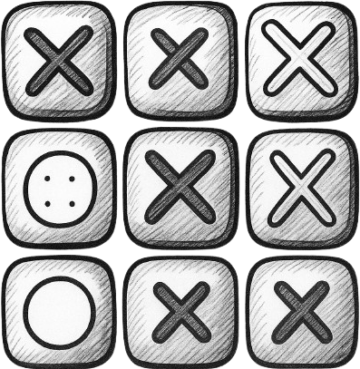

# 🎮 Tic-Tac-Toe Game

A modern, interactive Tic-Tac-Toe game built with React and Vite. Features player name editing, move history tracking, and a beautiful modal for game results.



## ✨ Features

- **Interactive Gameplay** - Classic 3x3 tic-tac-toe with alternating players
- **Player Customization** - Edit player names with inline editing
- **Move History** - Complete log of all moves made during the game
- **Smart Winner Detection** - Automatic detection of wins and draws
- **Beautiful UI** - Modern design with active player highlighting
- **Modal Results** - Elegant modal showing game results
- **Game Reset** - Easy restart functionality

## 🚀 Technologies Used

- **React 18** - Modern React with hooks
- **Vite** - Fast build tool and development server
- **React Modal** - Accessible modal component
- **CSS3** - Custom styling with modern features
- **ESLint** - Code quality and consistency

## 📦 Installation

1. **Clone the repository:**
   ```bash
   git clone https://github.com/kornieiev/tic-tac-toe.git
   cd tic-tac-toe
   ```

2. **Install dependencies:**
   ```bash
   npm install
   ```

3. **Start development server:**
   ```bash
   npm run dev
   ```

4. **Open your browser:**
   Navigate to `http://localhost:5173`

## 🎯 How to Play

1. **Start Game** - Player X always goes first
2. **Make Moves** - Click on any empty cell to place your symbol
3. **Edit Names** - Click "Edit" next to player names to customize them
4. **Win Condition** - Get 3 symbols in a row (horizontal, vertical, or diagonal)
5. **View History** - All moves are logged below the game board
6. **Restart** - Game automatically offers restart when finished

## 🏗️ Project Structure

```
src/
├── components/
│   ├── GameBoard.jsx      # Main game board with click handling
│   ├── Header.jsx         # Game title and logo
│   ├── PlayerInfo.jsx     # Player name display and editing
│   ├── Log.jsx           # Move history display
│   └── Modal.jsx         # Game result modal
├── helpers/
│   └── checkWinner.js    # Winner detection logic
├── App.jsx               # Main app component
├── App.css              # Main styles
├── index.css            # Global styles
└── main.jsx             # App entry point
```

## 🎨 Component Architecture

### App.jsx
- **State Management** - Controls active player, game turns, and player names
- **Game Logic** - Handles player switching and game coordination
- **Data Flow** - Passes props to child components

### GameBoard.jsx
- **Game Field** - Renders the 3x3 grid
- **Move Handling** - Processes player clicks
- **Winner Detection** - Checks for game end conditions
- **Game Reset** - Handles board reset functionality

### PlayerInfo.jsx
- **Player Display** - Shows player names and symbols
- **Name Editing** - Inline editing of player names
- **Active State** - Visual indication of current player

### Log.jsx
- **Move History** - Displays chronological list of moves
- **Game Tracking** - Shows player, row, and column for each move

### Modal.jsx
- **Result Display** - Shows winner or draw message
- **Game Actions** - Restart or continue options
- **Accessibility** - Proper modal implementation

## 🛠️ Available Scripts

- **`npm run dev`** - Start development server
- **`npm run build`** - Build for production
- **`npm run preview`** - Preview production build
- **`npm run lint`** - Run ESLint

## 🎮 Game Rules

1. The game is played on a 3×3 grid
2. Players take turns placing X's and O's
3. First player to get 3 marks in a row wins
4. Rows can be horizontal, vertical, or diagonal
5. If all 9 squares are filled with no winner, it's a draw

## 🔧 Customization

### Styling
Modify `App.css` and `index.css` to change the game appearance:
- Colors and themes
- Button styles
- Grid appearance
- Modal styling

### Game Logic
Extend functionality in `helpers/checkWinner.js`:
- Different board sizes
- Custom win conditions
- Additional game modes

## 🐛 Known Issues

- None currently reported

## 🤝 Contributing

1. Fork the repository
2. Create a feature branch (`git checkout -b feature/new-feature`)
3. Commit your changes (`git commit -am 'Add new feature'`)
4. Push to the branch (`git push origin feature/new-feature`)
5. Open a Pull Request

## 📝 License

This project is open source and available under the [MIT License](LICENSE).

## 👨‍💻 Author

**Dmytro Korneev** - [@kornieiev](https://github.com/kornieiev)

## 🙏 Acknowledgments

- React team for the amazing framework
- Vite team for the fast build tool
- React Modal library for accessible modals

---

Enjoy playing! 🎉

## React Compiler

The React Compiler is not enabled on this template because of its impact on dev & build performances. To add it, see [this documentation](https://react.dev/learn/react-compiler/installation).

## Expanding the ESLint configuration

If you are developing a production application, we recommend using TypeScript with type-aware lint rules enabled. Check out the [TS template](https://github.com/vitejs/vite/tree/main/packages/create-vite/template-react-ts) for information on how to integrate TypeScript and [`typescript-eslint`](https://typescript-eslint.io) in your project.
